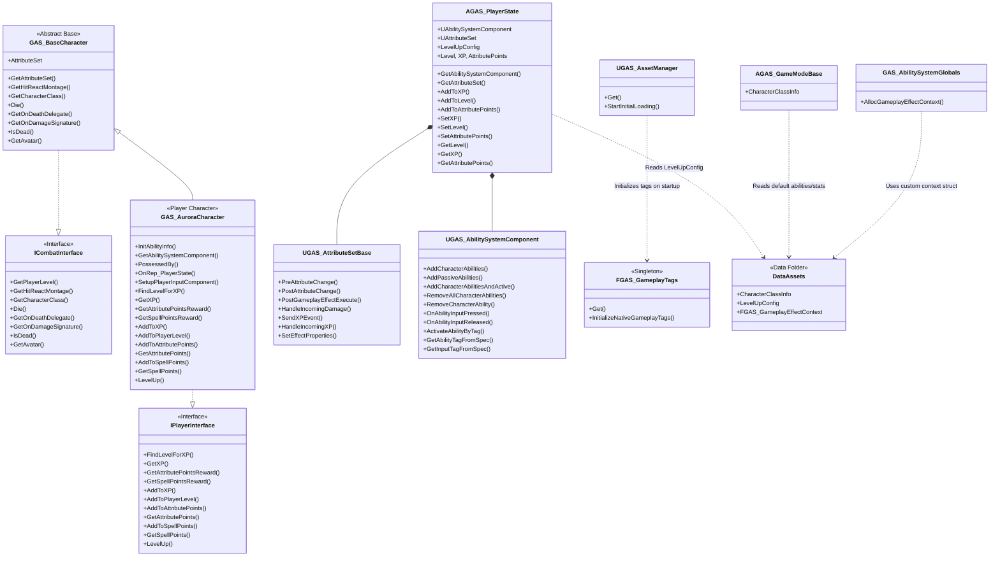

# Project Architecture Documentation: Unreal Engine 5 GAS RPG Prototype

## 1. Project Overview

This project is a third-person RPG/combat prototype built in Unreal Engine 5, utilizing the **Gameplay Ability System (GAS)**. The project features "Aurora" (from Paragon) as the playable character and demonstrates a highly scalable, data-driven, and loosely coupled architecture suitable for AAA action-RPGs. 

The core gameplay loop involves combat interactions, damage processing, and an RPG progression system (XP, Leveling, and Attribute Points). The architecture is designed to support rapid iteration by designers through data assets, while maintaining strict separation of concerns through C++ interfaces.

---

## 2. High-Level Architecture Diagram

---

## 3. Core Systems & Responsibilities

### GameMode & Data-Driven Character Setup
`AGAS_GameModeBase` holds a reference to a central data asset: `UCharacterClassInfo`. 
- **Why Data-Driven?** Hard-coding starting health, default abilities, or XP rewards into C++ classes creates a bottleneck. By moving this into a `UDataAsset` (which uses `ECharacterClass` to map to `FCharacterClassDefaultInfo`), game designers can add new enemy types, balance stats, and modify startup abilities (via `TSubclassOf<UGameplayEffect>` and `TSubclassOf<UGameplayAbility>`) entirely within the editor. 
- It uses `FScalableFloat` and Curve Tables to automatically scale enemy stats and XP rewards based on their level.

### PlayerState
`AGAS_PlayerState` acts as the definitive source of truth for player progression and GAS components. 
- **Ownership:** It owns the `UAbilitySystemComponent` (ASC) and `UGAS_AttributeSetBase`.
- **Responsibilities:** It handles replicated variables like `Level`, `XP`, and `AttributePoints`. It broadcasts multicast delegates (`OnXPChangedDelegate`, etc.) to update the UI.
- **Why PlayerState?** In Unreal Engine, a Pawn (Character) can be destroyed and respawned. If the ASC and Attributes were on the Character, all buffs, debuffs, health, and XP would be destroyed on death. By placing them on the `PlayerState`, the data persists across character possessions. It also allows for clean replication to all clients on a server, independent of pawn network relevancy.

### Character Hierarchy
The character structure is strictly hierarchical to maximize code reuse:
1. **`GAS_BaseCharacter`**: Inherits from `ACharacter`, `IAbilitySystemInterface`, and `ICombatInterface`. It holds physical combat properties (Hit React Montages, Death Sounds, `bIsDead` state) and generic combat functions. **No direct ASC ownership** is defined here, allowing child classes to decide where the ASC lives.
2. **`GAS_AuroraCharacter`**: Inherits from `GAS_BaseCharacter` and adds `IPlayerInterface`. It implements initialization logic specifically for a player (`InitAbilityInfo` grabs the ASC from the PlayerState).
- **Why separate them?** AI enemies and the Player share 90% of combat logic (taking damage, playing hit animations, dying). However, AI enemies typically own their ASC on the pawn itself (since they don't respawn and don't need persistent state) and do not need leveling logic. This hierarchy ensures AI classes aren't burdened with player-specific code.

### CombatInterface (`ICombatInterface`)
An essential interface that decouples the combat logic from specific character classes.
- **Key Functions:** `GetHitReactMontage`, `Die`, `IsDead`, `GetAvatar`, `GetCharacterClass`.
- **Why it exists:** When a fireball hits an actor, the fireball (or the AttributeSet processing the damage) needs to trigger a death sequence or a hit animation. If `AttributeSet` casted directly to `AGAS_AuroraCharacter` or `AEnemyCharacter`, it would create a hard dependency, leading to massive, tightly-coupled include chains. Instead, the AttributeSet checks if the target implements `ICombatInterface` and simply calls `Die()`. This allows *anything* (even a destructible barrel) to participate in combat if it implements the interface.

### PlayerInterface (`IPlayerInterface`)
Handles RPG progression logic.
- **Key Functions:** `GetXP`, `AddToXP`, `FindLevelForXP`, `LevelUp`, `AddToAttributePoints`.
- **Why separate from CombatInterface?** The Interface Segregation Principle (ISP). AI enemies participate in combat but do not earn XP or distribute Attribute Points. Separating these interfaces keeps the API clean and ensures classes only implement what they actually use.

---

## 4. AttributeSet & Damage Flow

The `UGAS_AttributeSetBase` handles vitals (Health, Mana, Stamina) and physical/mental RPG stats (Strength, Intelligence). It uses **Meta Attributes** to process gameplay interactions safely.

### Damage Flow Execution
1. A Gameplay Effect (GE) applies damage to the `IncomingDamage` meta-attribute.
2. `PostGameplayEffectExecute` intercepts this application.
3. `HandleIncomingDamage` evaluates the damage. It zeroes out the `IncomingDamage` attribute (so it doesn't persist).
4. **Death Check:** If Health drops to 0, it calls `CombatInterface->Die()` on the target. It then fires an event via `SendXPEvent` to reward the attacker with XP.
5. **Hit React:** If the target survives, it uses `UGAS_AbilitySystemLibrary::CalculateHitDirection` to determine where the attack came from (Front, Back, Left, Right). It then triggers an ability on the Target's ASC using a dynamic Gameplay Tag (e.g., `Effects.HitReact.Back`).

### XP Flow Execution
Similar to damage, XP is routed through the `IncomingXp` meta-attribute. `HandleIncomingXP` reads the value, consults the `IPlayerInterface` to determine if the new XP crosses a level threshold, mathematically determines how many levels were gained, grants Attribute Points, and calls `LevelUp()`.

---

## 5. Ability System & Input

The project utilizes a custom `UGAS_AbilitySystemComponent` along with custom base classes for abilities to streamline input and passive behaviors.

### Base Ability (`UGAS_BaseAbility`)
All active abilities in the project inherit from `UGAS_BaseAbility` (which extends `UGameplayAbility`).
- **Input Tagging:** It introduces an `InputTag` property (`FGameplayTag`). When abilities are granted via `AddCharacterAbilities`, the ASC reads this tag and assigns it as a Dynamic Spec Source Tag. This maps the ability directly to an input (e.g., Left Mouse Button, Key 1) without hard-coding input actions to specific ability classes.
- **Cost & Cooldown Helpers:** It provides `GetManaCost()` and `GetCooldown()` helper functions. These functions dynamically read the Cost and Cooldown Gameplay Effects assigned to the ability, evaluating their magnitude at a specific level to populate the UI.

### Passive Abilities (`UGAS_PassiveAbility`)
Passive abilities inherit from `UGAS_BaseAbility` but are designed for background behaviors (e.g., Life Siphon, Halo of Protection).
- **When do they work?** Passive abilities are activated instantly the moment they are granted. When `UGAS_AbilitySystemComponent::AddPassiveAbilities` is called, it uses `GiveAbilityAndActivateOnce()`. Unlike active abilities that wait for an `OnAbilityInputPressed` event, passives immediately begin executing their logic (e.g., applying an infinite buff or listening for gameplay events).
- **How do they work?** Once activated, the `UGAS_PassiveAbility` binds a callback (`ReceiveDeactivate`) to a multicast delegate on the ASC (`DeactivatePassiveAbility`). They remain active indefinitely until this delegate is broadcast with a matching Gameplay Tag, at which point the passive ability explicitly calls `EndAbility()` to cleanly shut itself down.

### Initialization & Input Routing
- **Initialization:** Handled gracefully on both Server (`PossessedBy`) and Client (`OnRep_PlayerState`).
- **Input Handling:** `OnAbilityInputPressed` and `OnAbilityInputReleased` route input directly to abilities matching the associated tags.
- **Ability Granting:** Uses helper functions like `AddCharacterAbilities` to loop through the startup abilities defined in `CharacterClassInfo` and grant them to the ASC.

---

## 6. Leveling & AI Scaling System

The project leverages Unreal's `UDataAsset` system heavily for scaling.
- **`ULevelUpConfig`**: Defines exactly how much XP is required for each level and what rewards are given (Attribute Points, Spell Points).
- **AI Scaling**: Because abilities and attributes are defined via `FCharacterClassDefaultInfo`, scaling an enemy simply requires spawning them and setting their Level variable. Their startup Gameplay Effects use `FScalableFloat` backed by Curve Tables, meaning an enemy at Level 10 automatically has drastically different health and damage coefficients than a Level 1 enemy, completely implicitly.

---

## 7. Project Data & Initialization Systems

The `Data` folder and core initialization classes (`AssetManager`, `AbilitySystemGlobals`, `GameplayTags`) serve as the backbone of the project, dictating how GAS interprets custom functionality and how static data is loaded.

### The Data Folder (`Source/GAS/Public/Data/`)
The project isolates core RPG configurations into highly accessible data structures:
- **`CharacterClassInfo.h`**: Contains `FCharacterClassDefaultInfo`, which defines `PrimaryAttributes` (Gameplay Effects), `StartupAbilities`, and `XPReward`. The `UCharacterClassInfo` Data Asset holds a map of these defaults per `ECharacterClass`. It also centrally stores Damage Calculation Coefficients, Common Abilities, and Vital Attributes.
- **`LevelUpConfig.h`**: Contains `FAuraLevelUpInfo`, holding level-up requirements and attribute/spell point rewards per level. The `ULevelUpConfig` Data Asset allows designers to explicitly control the XP progression curve.
- **`GAS_AbilityTypes.h`**: Defines the custom `FGAS_GameplayEffectContext` struct (detailed below).

### Custom Gameplay Effect Context (`FGAS_GameplayEffectContext`)
By default, Unreal Engine's standard `FGameplayEffectContext` carries basic information about an effect (who caused it, what ability triggered it, and the hit result). However, in an RPG, damage is rarely just a raw number. Systems need to know if the attack was a critical hit, if it was blocked, and what kind of physical force (knockback/death impulse) to apply to the target.

- **What it is:** `FGAS_GameplayEffectContext` is a custom struct inheriting from `FGameplayEffectContext`. It adds custom properties such as `bIsCriticalHit`, `bIsBlockedHit`, `DeathImpulse`, and `KnockbackForce`. It must implement custom `NetSerialize` and `Duplicate` functions so these new variables replicate correctly over the network.
- **How it is used:** To force the Gameplay Ability System to use this new context instead of the default one, the project overrides `GAS_AbilitySystemGlobals::AllocGameplayEffectContext()` to return `new FGAS_GameplayEffectContext()`. This globally replaces the context struct for every effect in the game. (Note: `GAS_AbilitySystemGlobals` must be registered in the project's `DefaultGame.ini` for this to take effect).
- **Where it is used:** Whenever an Ability applies a Gameplay Effect (e.g., dealing damage), it creates a Gameplay Effect Context. Programmers or Execution Calculations (ExecCalcs) can cast this context to `FGAS_GameplayEffectContext` and inject data (e.g., `Context->SetIsCriticalHit(true)`). 
- **Why it is used (Example):** Imagine a heavy hammer attack. When the ability hits an enemy, an Execution Calculation determines the raw damage. If the math determines a critical hit occurred, it sets `bIsCriticalHit = true` and `DeathImpulse = FVector(1000, 0, 0)` inside the context. When the target's `AttributeSet` receives this effect in `PostGameplayEffectExecute`, it can read the context. If the attack drops the enemy's health to 0, the AttributeSet reads the `DeathImpulse` from the context and passes it to `ICombatInterface::Die(DeathImpulse)`, sending the enemy's ragdoll flying backward. This keeps the physical logic entirely decoupled from the ability itself.

### `GAS_AbilitySystemGlobals`
Unreal Engine allows overriding global GAS behaviors via this class.
- **Functionality:** Its primary role in this project is overriding `AllocGameplayEffectContext()` to inject the custom `FGAS_GameplayEffectContext` into the pipeline, guaranteeing that all effects have access to RPG-specific hit data.

### `UGAS_AssetManager`
The `UAssetManager` singleton is customized to hijack the initial engine loading phase.
- **Functionality:** It overrides `StartInitialLoading()` to call `FGAS_GameplayTags::InitializeNativeGameplayTags()`.
- **Why it matters:** It ensures all native C++ Gameplay Tags are registered with the engine *before* any Data Assets, Blueprints, or Gameplay Abilities are loaded. This prevents crashes or missing tags during startup.

### Custom Native Gameplay Tags (`FGAS_GameplayTags`)
A static singleton struct that manages all C++ declared Gameplay Tags.
- **Functionality:** Centralizes tag creation using `UGameplayTagsManager::Get().AddNativeGameplayTag`. Tags cover Attributes, Inputs, Damage Types, Resistances, Debuffs, Abilities, and Sockets. It also maps damage types to their corresponding resistances and debuffs (e.g., `Damage_Fire` maps to `Resistance_Fire` and `Debuff_Burn`).
- **Why it matters:** Hard-coding tag strings (e.g., `"Attributes.Primary.Strength"`) across different `.cpp` files is highly prone to typos. Storing them as explicit `FGameplayTag` variables in a singleton guarantees type safety, fast comparisons, and central management.

### Linkage & Initialization Flow
1. **Engine Start**: `UGAS_AssetManager` hooks into `StartInitialLoading()`.
2. **Tag Registration**: The Asset Manager calls `FGAS_GameplayTags::InitializeNativeGameplayTags()`, fully populating the tag manager before the game world exists.
3. **Globals Setup**: The Engine initializes `GAS_AbilitySystemGlobals`, configuring it to spawn `FGAS_GameplayEffectContext` instead of the base struct.
4. **Gameplay Phase**: The `GameMode` loads the `CharacterClassInfo` Data Asset (using the securely registered tags) to determine default abilities. When damage occurs, the system utilizes the newly configured `FGAS_GameplayEffectContext` to process critical hits and death impulses seamlessly.

---

## 8. Key Design Patterns & Decisions

1. **Interface-Driven Development (Loose Coupling)**: The most prevalent pattern in the project. The AttributeSet does not know what an `AuroraCharacter` is. The AbilitySystemComponent does not know what an `Enemy` is. Everything communicates via `ICombatInterface` and `IPlayerInterface`.
2. **Data-Driven Architecture**: Designers can create a new character class (e.g., "Mage"), assign it a different health curve, different startup abilities, and different XP rewards without a programmer writing a single line of C++.
3. **Component-Based Composition**: Leaving the ASC initialization out of the base character allows the Player to store their ASC on the `PlayerState` while allowing AI to store their ASC on the `Character` directly.
4. **Overall Initialization Flow**: Explicitly chaining tag initialization in the `AssetManager` and context overriding in `AbilitySystemGlobals` ensures absolute predictability in the boot sequence, avoiding the race conditions common in complex GAS projects.

---

## 9. Strengths & Areas for Future Improvement

### Strengths
- **AAA Standard Practices**: The use of Meta Attributes, PlayerState ASC ownership, and Interface-segregated damage flow aligns perfectly with how studios like Epic Games and CD Projekt Red handle massive RPG codebases.
- **Highly Extensible**: Adding a new stat (e.g., "Agility") or a new character class takes minutes because the foundational plumbing is highly generic.

### Areas for Future Improvement (Constructive Feedback)
1. **Execution Calculations (ExecCalcs)**: Currently, damage is applied directly to the `IncomingDamage` meta attribute. As the RPG grows, armor, resistances, critical hits, and elemental damage will make this complex. Moving the damage formula into a native `UGameplayEffectExecutionCalculation` would cleanly isolate the math logic away from the Attribute Set.
2. **Spell Points System**: The `IPlayerInterface` stubs out `GetSpellPointsReward` and `AddToSpellPoints` (currently returning 0 or doing nothing). This should be implemented to allow for a skill-tree progression system.
3. **Predictive Hit Reacts**: Hit reactions are currently driven by the Server executing `TryActivateAbilitiesByTag`. Depending on network latency, this could feel sluggish. Investigating local prediction for hit reacts (or playing the montage directly before syncing) could improve game feel on high-ping client connections.
